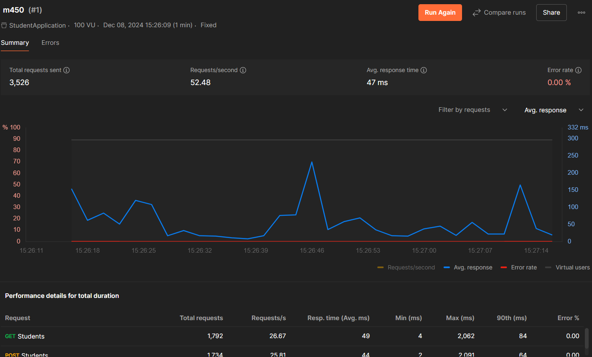

# Automation Testing

## Aufgabe 1

[Postman Collection Export](StudentApplication.postman_collection.json)

Newman Installation:

`npm install -g newman`

Newman Run:

`newman run StudentApplication.postman_collection.json`

Resultat in der Konsole: 


In Postman können die Tests auch automatisiert ausgeführt werden.

## Aufgabe 2

Protractor installieren

`npm install -g protractor`

WebDriver Manager installieren

`webdriver-manager update`

Project Dependencies installieren

`npm install`

protractor.conf.js

```javascript
exports.config = {
  directConnect: true,
  framework: 'jasmine',
  specs: ['e2e/**/*.e2e-spec.ts'],
  capabilities: {
    'browserName': 'chrome'
  },
  onPrepare: () => {
    require('ts-node').register({
      project: require('path').join(__dirname, './tsconfig.e2e.json')
    });
  }
};
```

tsconfig.e2e.json

```json
{
  "compilerOptions": {
    "target": "es6",
    "module": "commonjs",
    "moduleResolution": "node",
    "outDir": "./dist/out-tsc",
    "sourceMap": true,
    "emitDecoratorMetadata": true,
    "experimentalDecorators": true,
    "lib": ["es2018", "dom"]
  },
  "include": ["e2e/**/*.ts"]
}
```

[Tests](app.e2e-spec.ts) erstellen im e2e Ordner

Angular Application starten

`ng serve`

Test laufen lassen

`npm run e2e`

Ergebnis:


## Aufgabe 3

In Postman bei der Collection oben rechts auf "Run" klicken


Dann auf den "Performance" Tab wechseln & 100 Virtual Users eintragen (mehr get nicht), dieser Test lassen wir hier für 1 Minute laufen. Man könnte auch längere Zeiten einstellen und ein anderes Load Profile wählen.

Schlussendlich auf "Run" klicken, um den Test zu starten.


Das Resultat sieht dann ungefähr so aus:


