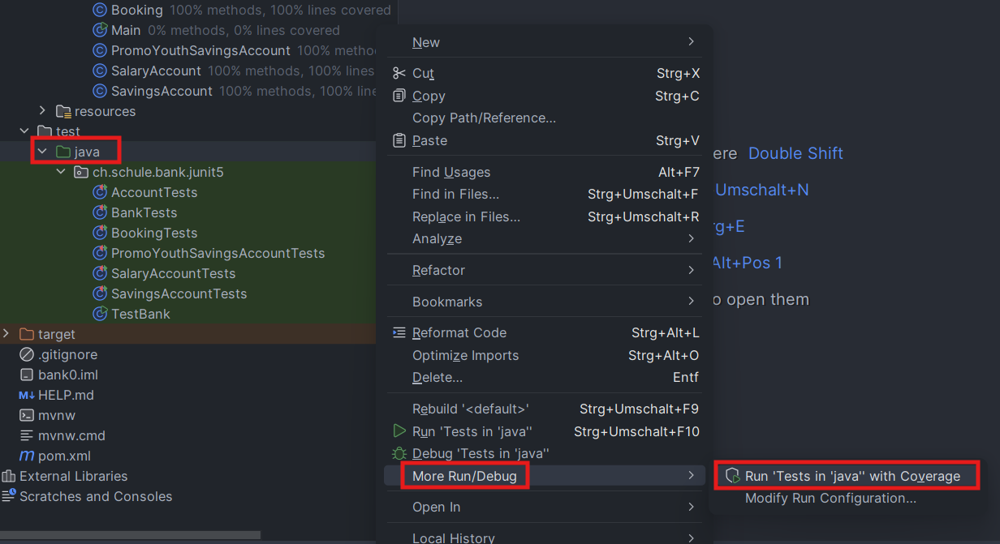
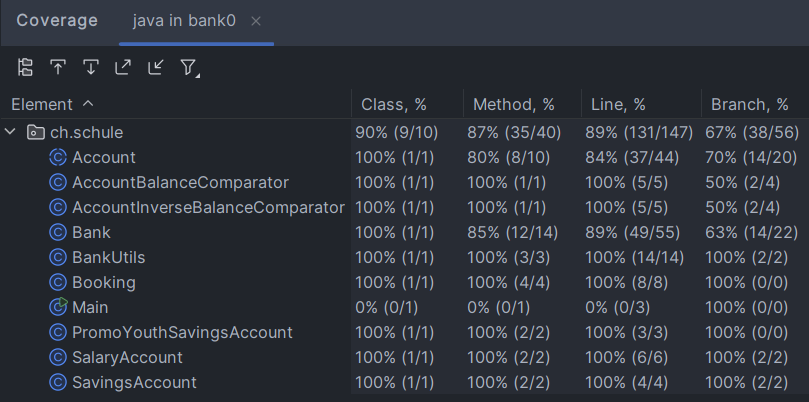

# Test-Levels-Unit-Testing

## Aufgabe 1

Unter src/main/java/test_levels_unit_testing ist die Calculator Klasse mit allen Methoden.

Unter src/test/java/test_levels_unit_testing ist die Test-Klasse CalculatorTest mit den Tests und Annotationen.

Mit `mvn test` können die Tests ausgeführt werden über die Konsole oder einfach über den grünen Pfeil.

## Aufgabe 2

### JUnit 5 Features Zusammenfassung

#### 1. **Test-Annotation (@Test)**

Die grundlegende Annotation für die Kennzeichnung von Testmethoden. Jede Methode, die mit `@Test` versehen ist, wird von JUnit als Test betrachtet und ausgeführt.

##### Beispiel:
```java
@Test
void testAddition() {
    Assertions.assertEquals(5, calculator.add(2, 3));
}
```

---

#### 2. **Assertions**

JUnit 5 bietet viele Assertion-Methoden, um Ergebnisse zu überprüfen. Einige der gängigsten sind:
- `assertEquals(expected, actual)` – Prüft, ob zwei Werte gleich sind.
- `assertTrue(condition)` – Prüft, ob eine Bedingung wahr ist.
- `assertFalse(condition)` – Prüft, ob eine Bedingung falsch ist.
- `assertThrows` – Prüft, ob eine Methode eine bestimmte Ausnahme wirft.

##### Beispiel:
```java
@Test
void testDivision() {
    assertThrows(IllegalArgumentException.class, () -> calculator.divide(1, 0));
}
```

---

#### 3. **@BeforeEach und @AfterEach**

Diese Annotations werden verwendet, um Methoden vor und nach jedem Test auszuführen. Sie sind nützlich, wenn du Setup- oder Cleanup-Schritte für jeden Test durchführen musst.

- `@BeforeEach`: Wird vor jedem Testfall ausgeführt.
- `@AfterEach`: Wird nach jedem Testfall ausgeführt.

##### Beispiel:
```java
@BeforeEach
void setup() {
    calculator = new Calculator();
}

@AfterEach
void cleanup() {
    calculator = null;
}
```

---

#### 4. **@BeforeAll und @AfterAll**

Diese Annotations sind für Setup- und Cleanup-Methoden gedacht, die einmal vor und nach allen Tests ausgeführt werden. Sie sind statisch und werden nur einmal für die gesamte Testklasse ausgeführt.

- `@BeforeAll`: Wird einmal vor allen Tests ausgeführt.
- `@AfterAll`: Wird einmal nach allen Tests ausgeführt.

##### Beispiel:
```java
@BeforeAll
static void setupAll() {
    System.out.println("Testbeginn");
}

@AfterAll
static void cleanupAll() {
    System.out.println("Testende");
}
```

---

#### 5. **@Disabled**

Mit dieser Annotation kannst du Tests vorübergehend deaktivieren. Dies ist nützlich, wenn du Tests für eine bestimmte Zeit nicht ausführen möchtest.

##### Beispiel:
```java
@Disabled("Dieser Test ist momentan deaktiviert")
@Test
void testNotImplemented() {
    // Testcode
}
```

---

#### 6. **@ParameterizedTest**

Mit `@ParameterizedTest` kannst du denselben Test mit verschiedenen Eingabewerten ausführen, ohne den Testcode mehrfach zu schreiben. Dies ist besonders nützlich, wenn du denselben Test für verschiedene Werte testen möchtest.

##### Beispiel:
```java
@ParameterizedTest
@ValueSource(ints = {1, 2, 3})
void testAddition(int number) {
    assertEquals(5, calculator.add(number, 4));
}
```

---

#### 7. **@Tag**

Mit `@Tag` kannst du Tests mit bestimmten Tags versehen und diese in deinen Testsuiten filtern. Das ist hilfreich, wenn du nur eine bestimmte Gruppe von Tests ausführen möchtest.

##### Beispiel:
```java
@Tag("fast")
@Test
void fastTest() {
    assertEquals(2, calculator.add(1, 1));
}
```

---

#### 8. **@TestInstance**

Mit `@TestInstance(Lifecycle.PER_CLASS)` kannst du die Lebensdauer einer Testinstanz ändern, sodass die Instanz der Testklasse nicht für jede Methode neu erstellt wird. Standardmäßig wird für jede Testmethode eine neue Instanz der Testklasse erstellt.

##### Beispiel:
```java
@TestInstance(TestInstance.Lifecycle.PER_CLASS)
class CalculatorTest {
    private Calculator calculator = new Calculator();

    @Test
    void testAdd() {
        assertEquals(5, calculator.add(2, 3));
    }
}
```

---

#### 9. **@Nested**

Mit `@Nested` kannst du Tests in Unterklassen gruppieren, um Tests zu strukturieren und zu kategorisieren. Diese Funktion hilft bei der Organisation von Tests in einer großen Testklasse.

##### Beispiel:
```java
@Nested
class AdditionTests {
    @Test
    void testAddPositiveNumbers() {
        assertEquals(5, calculator.add(2, 3));
    }

    @Test
    void testAddNegativeNumbers() {
        assertEquals(-1, calculator.add(-2, 1));
    }
}
```

### Referenz

[JUnit 5 User Guide](https://junit.org/junit5/docs/current/user-guide/)

## Aufgabe 3

### Klassenstruktur und Hauptkomponenten

#### 1. Bank
- Zentrale Klasse für die Verwaltung von Bankkonten
- Hauptmethoden:
    - `createAccount()`: Erstellt neue Konten
    - `deposit()`: Einzahlungsfunktion
    - `withdraw()`: Auszahlungsfunktion
    - `getBalance()`: Kontostandabfrage
    - `print()`: Druckt Kontoinformationen

#### 2. Account (Basisklasse)
- Abstrakte Basisklasse für alle Kontotypen
- Attribute:
    - `balance`: Kontostand (long)
    - `id`: Kontoidentifikation (String)
- Grundlegende Funktionalitäten:
    - `deposit()`: Einzahlung
    - `withdraw()`: Auszahlung
    - `print()`: Kontoausdruck
    - `canTransact()`: Prüft Transaktionsmöglichkeit

#### 3. Spezialisierte Kontoarten
##### SavingsAccount
- Erbt von Account
- Speziell für Spareinlagen
- Eigene Implementation von `withdraw()`

##### SalaryAccount
- Erbt von Account
- Speziell für Gehaltseingänge
- Eigene Implementation von `print()`

##### PromoYouthSavingsAccount
- Erbt von SavingsAccount
- Speziell für junge Sparer
- Erweiterte `deposit()` Funktionalität

#### 4. BankUtils
- Hilfsklasse für Formatierung und Verarbeitung
- Funktionen:
    - `AMOUNT_FORMAT`: Dezimalformat für Beträge
    - `TWO_DIGIT_FORMAT`: Zweistelliges Dezimalformat
    - `formatAmount()`: Formatiert Geldbeträge
    - `formatBankDate()`: Formatiert Bankdaten

### Beziehungen und Zusammenhänge

#### Vererbungshierarchie
1. Account (Basisklasse)
    - SavingsAccount
        - PromoYouthSavingsAccount
    - SalaryAccount

#### Assoziationen
- Bank ←→ Account (1:n Beziehung)
- Account ←→ Booking (1:n Beziehung)
- Alle Kontoklassen nutzen BankUtils für Formatierung

### Funktionsweise

#### Kontoverwaltung
1. Die Bank erstellt und verwaltet Konten
2. Jedes Konto hat einen eindeutigen Identifier
3. Transaktionen werden als Bookings gespeichert

#### Transaktionsablauf
1. Kunde initiiert Transaktion
2. Bank prüft Berechtigung
3. Account führt Transaktion durch
4. Booking wird erstellt und gespeichert

#### Sicherheitsmechanismen
- Prüfung der Transaktionsberechtigung
- Kontostandsvalidierung
- Formatierungsprüfungen durch BankUtils

### Technische Details

#### Datentypen
- Kontostand: `long` (Vermeidung von Rundungsfehlern)
- Identifikationen: `String`
- Datumsangaben: Standardformatierung durch BankUtils

#### Validierungen
- Kontostand darf nicht negativ werden
- Transaktionen müssen gültige Beträge haben
- Formate müssen den BankUtils-Vorgaben entsprechen

### Erweiterbarkeit
- Neue Kontoarten können durch Vererbung hinzugefügt werden
- Erweiterung der BankUtils für neue Formatierungen möglich
- Flexibles Booking-System für verschiedene Transaktionstypen

## Aufgabe 3

Tests mit Code Coverage laufen lassen:



Code Coverage Ergebnis:




